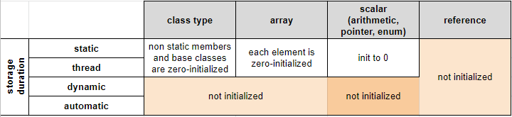
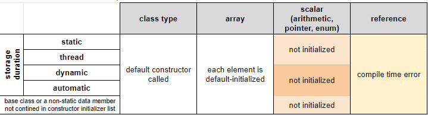
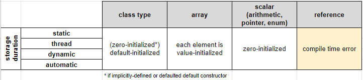

# Initialization
- Provides initial value of a variable at the time of construction.
- Initial value may be provided in:
    - initializer section of a declarator
    - a `new` expression (see [[dynamic_memory]] )
    - [[function calls]]: function parameters and the function return values

- Non-local static and thread local variables are first static initialized
    - If relevant, **constant initialization**: sets the initial values of the static variables to a compile-time constant. 
    - Otherwise, zero-initialized, see below

- Depending on the syntax and the conext one of the following initializer is applied:

| Initialization           | Example                       | Short description                                                 |
| ------------------------ | ----------------------------- |  ---------------------------------------------------------------- |
| Default Initialization   | std::string;                  | no initializer specified                                          |
| Value initialization     | std::string s{};              | empty initializer.                                                |
| Direct initialization    | std::string s("hello");       | Initializes an object from explicit set of constructor arguments. |
| Copy initialization      | std::string s = "hello";      | Initializes an object from another object.                        |
| List initialization      | std::string s{'a', 'b', 'c'}; | Initializes an object from braced-init-list.                      |
| Aggregate initialization | char a[3] = {'a', 'b'};       | Initializes an aggregate from braced-init-list.                   |
| Reference initialization | char& c = a[0];               | Binds a reference to an object.                                   |

## Zero Initialization

## Default Initialization

## Value Initialization

